# Лабораторная работа №4. Симуляция с пользовательсĸими ĸоллеĸциями и псевдослучайной моделью

## Введение. Объектно-ориентированный кисель: казино с гусями
Выбранный вариант лабораторной работы - второй.

Добро пожаловать в лучший игорный дом Лас-Вегаса!

Вечер пятницы настал, ночной покров опустился на улицы, которые быстро стали пустынными. Встреча шла по плану. Студенты МАИ, как нынешние, так и уже выпускники, собрались здесь сегодня на долгую, комфортную игровую сессию. В приятной компании знакомых, за выпивкой и закусками, все игроки получают удовольствие... Кто-то, ослепленный лудоманией, бесконечно крутит слоты в попытках выбить три семерки, кто-то сидит за столом

.........Н̴̨̧̧̨͈̼̭̞̣͚̪̖͇̬̭̭͇̣̝̼̞̯͇͙̰̯̞̎̽̉͊̃̋̋̅̆̆̓̀̀̏̌̀̇̌̇͂́̈̉͛̉́̃̐̂̋̏̎̆̄̄͌̕͜͜͜͠͝͝͠И̵̢̨̖̜̥̰͍̣͖̙̙͎͙̻̜̹̖́͐͐̏̏̎̇͗́̆́̋́̌̒̽͛̈́̔̎̒̋͌͆̑̆̈́͐̑̏̐̄̀̏̐̇̽́͘͘͘͘̚͜͝͠͝͠͝͝К̸̛̣̜͇̱̣̉͆̍̃̋̓͛̍̈́͐̈́̆͒͊͐͝ͅА̴̨̨̡̩̦͕̦͕̖̫̗̝̳̰͔͇͔̜̥̏͒̉͆̄̏̋̈̏͗̔̈̈͗̈̍͆̌̀̑͌̑̂̒̽̇͂̏̅͑͐̽̈̚͠͝͠К̴̡̧̛̩̘̪̺͍͈̲͖͍̪̥͚̱̥͉̮̮̖̼̰͍̱͖͓̠̫̠̘̹̞̠̤̜͇̘̭͍͈̱̤̗̺͔̏̈́͗̀͑͊̉͗̑̂̅̾̿̋̍̒̊̓̈́̐̂̈́͋̏̈́̃̈́̎͗̀͆̀̏̉̅̆̈́͌̈́̎͒̅́͐̚̚̕͜͠͠ͅͅИ̸̢̢̢̛̛͍͇͇̰̺̞̜͉̯̣͈̻̮̰͚̖̗̻͖̞̼̳͍̥͛͐́̋̓̆̿͒͑̅̈́̄̋̉̓̔̆͋͆̐̒͆͘̕̚͘̕͝͝Х̶̛̛̟̞̞̥̯͇͛͑̈̋̓̉̋̉̍̃̎͋̇̑͂̃͆̎̈́̅̈́̄̒́̇̑̀̊͂̕̕̕̕͝͠͠͝ ̴̢̢̢̧̧̛̜̝͚̲͖̖̹̗̱͔̻͎͍͓͔̪͉̯̻̹̣̣̘̠̼̜̙̬̬̗͚̘͚͓͕͕͒̒̋́͐̔͑̉͒͗̈́͋̎̓̽̊̌̇̂͌͌́͐͌̀̔̅̾̐͊͋̂̐͘̚͝͠͝ͅБ̸̨̢̨̧̡̢̰̺͓̤͔̹͕̼̮̪͙͈̤̪̣̤͈̦̘̗̟͇̹̣͕͙͙̥̞̞̘̥̿̌̉̇͂̓̀͊̉̈́̀̂̑̀̊̏̇̈͆́̚͜͠͠Ӧ̷̡̨̡͎̗͈̝̗̹͕̮͓̲͈́͛̀͛͊̆̉̐̈͌͋̉̋̓̊͐̇̍́̽̾͋̇͌͒̑̊͌́͐̀͆͘̚̚͜͝͝͝͠͝Л̶̢̢̧̧̛̩̹̪̝̫̙̯̲͕͚̱̬̿͋̓̈́̋̅͜͜Ь̴̧̨̨̢̛̞̬̲̬͓̟̗̮̠̤̙̼̗͈̠̦̥̙̲̩̹̫͓͙̫̭͔̫̜̘͈̮̀̈̉́̌̈̎̏̓̃̂̐̈́͑̀͆́͐̚͜ͅШ̵̘͚͖͚͖̙͚͚̳̩͔̟̅̍͌̎̓̃̓̂͋͛̈̽́̎̿̒̄̒̆̌̏͑̈́̈́͒̓́͐̾̈́̅̄̋͗͛̆̔̈́̓̆͐͘͘͜͠Е̷̥̐̊̏̓̀ ̶͚̝̙̤͋̌͛̉̽̐͌̓̒̈́̀͐̊̋̐̕̕̚̕Д̸̢̛͈̹̞̪͇̥̫̘̹̣̩̙̫͈͍̝̩̺̻̉̌͆̃̃̾͌̾͑̏̿̓̽̾͋̕͝͠О̸̡̡̘̻̱̫̱̜̼͇̖̖͕̦͔͕̦͇̫̮͓̺̱͕̰̘͇̜̖͈͉͈͍͑͋̑͒̂̊̑̀̐̂̚͜͝ͅД̶̞̥̜̯̰̘̤͚̪͍̺͇̙̤͖͚̱̪̩̣͖̙͊̏̌̿̉͑̊͂̃̂͆͐̅̀̈́̇͌̃̿̐̈́̆̾̓͘͜͠͝͝Е̶̨̧̮̺̬̲̖̙̥͓̞̥̩̩̙̞̬̺͕̯̙̞͖̖͈̝̝̟̹̩̜̻̟͚̪͇̝̮͚͗̐̊͊̒̍̈́̀́͗͑̏̂̂̄͗͆̂̑̐͌̆̄̿͑̀͂͛̾́͊́̕̚̕͝͝͝͝ͅͅП̸̧̛̛̟̟̻͕̼͖̙͖̪͖̮̊̈̃͋̂̀̊͒̑͊͒̿͗̿͌̀͐͋͌̋̍̉̒̋͂̎̈́̀̈́͊̈́̑͝͝ͅͅО̷̨̧̢̢̢̛̮̬̻͓̪̖͍͍̗̼͉̼̠̜̠̤̲͓̳̞̟̫͍̖͔̠̻͈̱͉̜̭̯̱̮̠̲̱̰̼̟̱̃͗͑̉̀̓̍̿͐̌͌̂̒͑́͋͂̉̐̈́̌̌̇̓̏̈́͗̂͐̄̏̍̽̍͆̆͛̚͘͘̚͜͝͠͠В̷̢̡̥̹͍̭̺̠̲̙̱̟̳̰̭̖̪̥͇͍̻͉̦̳͇͇͕͇̞̬͓̉̓̏̏̇͊́̈́͐́͐̾͋̄̀̑̈́͌̀͛͐̃̈́̎͋̌͂̋̊̚͜͜ͅͅ.̵̨̡̨̛̛̙̳̬̫̭͕͓͉̻̟̫̩̟̥̯̰̞̻̣͍̞̤̻͔̣̰̙͎̬̟̥̩͇̝͚̲͖̤̗̿̑͒͗̿̾͐̈͊͊̌͒̍͊̽͒͐̌̉̊̉̀͐̒̓͑̓͊͐̌̌̓͋̕ͅͅͅͅ ̷̢̦̣̭̜͌͛͌̀̂̋̉͗̈͊͐̽͜͝Н̴̡̧̧̢̧̮̟̩̬̙̭̬̼͚̤̱̳̯̱̜̗̞͉̤̞͙̰̙̦̘͓̬̲͈̣̭̳͖̦̘̠̺̥̹̊͌͜И̸̧̧̛̪͍̖͚̺̙͚̼͔͇̮͇͉̩̠͓̯̣͉͚̗̤̥̺̪͎̯̱̼͖̝̣͍͎̰͉̇̋̊̇̅̐̑̀̓̈̓͑͆̂̾̾̌͆͗̒͊̆̏̕͘͜͜͜͠ͅК̵̡̧̢̡̛̛̳̱͚̠̫̮͉̥̝̔͂͑̏̍́̃͊͑̑̈͑͛̓̿̂̎̈́̈́͒͆͛̐̀̐̓̊̽͐͌̔̃̈́͌̋̊̎̉̊̇͋͂̅̃͘͠͠О̶̨̛͈̙͙̘͎̬͎̯̲̺͍̘͈̞̼̤̩̟̙̥͔͖͎̫̞͕͎̯̟͉̤̯̮̉̀̈́̌̂̒͌̄̏̒̊̋͒̑̏͋̄͛̔͛̉͗̑̍̏͌́͑́̃́̂̔̈́̇̈́̿͘̕̕͝͠͝͠Г̶̡̼͉͉̖̦͐̋̈́̋̓̄̊͑̋̎͂̈́̾̋̒̈̈́̏̋͘͝Д̵̨̡̧͉̳̗͔̙͚̙̥̜̦͓̱̣̝̔̈́́̑̑̒̈̄͑̒͒̓́̈̔͛̅̄̓͊̓̊̋̿͝͝А̴͇͉̤̹̲̟͒́͋̎̿́͋̇͌͘͝͝͝ ̸̳̼̹̓͐́̐̎̌͘ͅИ̶̡̱̮͓̘̰̯̖͖͚̩͕͚̤̻̗̺͉̠͓͖̝̱͇͚͙̬̜̞̜̭̪̃̈́͒̎̓̿͊̈́̽̒͊̔̉̚͜͜͝ ̴̛̛͔̙̩̩̥̪̹̘͙̙̼̹̲͔͕̘̖̼̠͍̗̯̝̀́͂̏͗́̉̿͑͐́͌͗̈͌͐͆̆̊́̉̌͐̃͛̏̐̐̏̿̔̈́̿͘̕͝͝͠Н̵̨͇̦͇̥̐͋͋͗̿͊̉͋̉̓͛̄̓̋́̅̌̈́͊͗͒͒͂̌̃́̃̈̔͊͗̎͗͒̎̎̀̐̔͑͋͆̌̈͜͠͝͝И̶̢̡̧̛̯̤̖̫̲̖̮̫̬̼̟̺̫̠͙̤̞̩̮̝̭̺̲̑̑̽̎̽̓̂̈̒̾͌̈͐̍̅̇̎͗̈̾͐̎͜͝͝͝͠ ̵̛͍̪̖̞͖̫͉̏͐̅̃̌̋͐̇͋̓̓̋̇̐̔͌͑̒̊̃͒͠͠͝П̷̢̢̨̢̨̛͍̜̰̜̙͓͓̮̫͎̮̳͕̖̗̳͕͍͓̮̖̬̥͎̮̮͚̱̼͓̫̈́͗̔̑̿͊̐͛́̎̒̔̿̂͆̄̇̆̌́̅͛̓͋̂̇̂͘͜͜͝Р̷̨̧̛̰͔͉̜͇̯̰͎̦̻̼̭͉͖̺̣̪̟͔̳̱͓͈̰͍̏̅͂̑̓̍̇̉͌̿́͐̽͒̓̒͆̕̚͘И̵̢̧̡̛̳͔͔͈͙̜͇̱̲̘̑̂͌̾̀̑͒̾͆́́̓̅͛̊̅̿͆̽̽̈̾̽́̋̕͝͝͠͠ ̸̧̫͕̮̗̦̪̤͎̝͎̲͇̰̰̣̠̼̭̰̱̩̤̙̬̼͖̲͕͇̫̜͔͔̫̞̤̩͎̗̫̗͖̖̝̮̼̘̤̿͊̊̓̈́̊̂̽̌́̌͛̐͛͂̏͒̀͌̌̑͌̄͘̚͜͝͝͝К̶̨̡̢̛̪͎̬̳͇͙͎̼̮̗͖͕̳̰͋̐̂͆͌̅̒͐̊̈́̔̃̑̑̄́̋̅̃̑̉̈́͌͑̃͌̒̏̽̚̚͘͘͘͜͝͠А̴̠̯̖̙͈̥͑͆̈́̓̑̑̓̈́̾̅͐͜ͅК̸̢̢̢̥̲̫̲̖̭̦͓̳̻̘̳̺̖̳̦͇̙̩͙̹͖̺̫̟̞̥̬̯̟̝̂И̷̛̛̼̗̫̯̟̲̜̬̘̘͉͓̳̪͚̼͎̬͇̥̳̩͂̑́̉̋̌͛͊̅̄̏́̏́̆̐͛́̉͛̆̈́͆̈́́̽̾͂̎̈́̑̊̊̋̌͋̊͘͘͝͝͝͝͝͝Х̵̧̛̞͓̹͓̰̘̗͎̮̘̙̰̣̼̝̤̞̜̜̺͈̭̩͖̤̻̽̊͌̀̀̄͗̊͊͋̃͆̏͒̾̋̓͋̉̃̍̽̅́̐̊̓̉͋͒̚͜͠͝ ̷̢̼̼̺̟̮̩̣̠̪̦̣̮̖̤̘̞̳͖̞̜̖͔̲̬̺̞̻̓̇̎͜ͅУ̴̧̢̝͍̯͍̠͙͔͉̱̤̙͈̭̱̠͓̗̘͇̼͔̹͖̗̗̠̠̙̏̃̉̾̿̅̾̇̏̕̕̚͝ͅС̶̪̋̔̓̓̏̎̄̂̋̽̀̇̉̈́͑̽̍̂̃̔̅͐̈́͂̽̈̚͘͝͝Л̶̧̹͉͖͇̤̙̬͎͆̏̇́̇͋̃̀͐̑̚̚͝͝О̶͈̓̄̽̓̀̐̿̔͘В̸̡͙̠̻͉̝̙̞̣͕͍̩̋̋͆̎̀͜И̷̨̛̛̮̤̟̟̙͈͉̝͔̮̤̻͇̭̱̠̔̀́͂̽͌̈̏̈́̑͋̇̓̑̾̑͑̑̊͌̃̇̃̇͐͑̓̕͘͘̕͘͜͠͠͠͝͝Я̵̢̬̭̙͇͚̳̻̰͓̙͎͕̤̱̗̥̝͓̘̣̥̖̪͉͕̤̻͇̒̀͑͂̿͘̕Х̶̡̡̨̢̖̖̩̻͖̳͎̲͔̖̣̤̭̮̟̹̘͖͓̟̙̫̄́̋̈́̾́̊͑̉̏̅̇͛̍̅̿̌̈̄̆̋͂̀̀̑̀̓̕̕͠͝.̵̡̨̛̛̭͈̦̥͎̫̪̥̘̐̏̑̍̃̓̽͒̆̄̎̒̈́̓́̎̓̈́͠ ̸̧̡̛̪͍̜͓̺͓͍̩͇̟̝̺̯̠͈̗̦̪̯͈̼̩̤͈̠̜̱̖̩̝̳̝̙͈̬̮͎̻̩̽̂͐͒͂͊̒̋̆̾̋̌̆̍̈́͑̈́͂̎͑̑̑͛̓̈́̆̈́̐̿̈̄̉͌̉̉̅̈́̀͋͒͛͗͌̆͒̕͜͝͝͝ͅК̷̺̺̤̤͑̅̈̐̈́̂̓̉А̸̢̢̢̫̻̞̗̟͎͕̞͙̗̹͎̖̫̮̙̠̭͚͉͇̼̫̪͍͇̰͔̜͉̱̣̺̱̪̤̰̫̰͑́̓̓̇͂͐̀͑͗̿̈́̅̄̈͜͜З̵̢̧̝̤̘͖̳̦̘̘͈̰̖̎̎̍͊̊͗̉̂͐̓̒̉̉̇͐͋̔͒͆̽̅͑̿̾̽̈͑̃̎̓̇͗̿̓̀̉̿̋͗̈́̕͘̚̚͠И̵͇̻͉̹̦̾́͘Н̴̧͚͖̫̺̮̟͇̜͕̝̩̮̗̠̘̫̬̼̭̹͒̋̈́͛͗̅͌̓̿̆̈́͐͂̉͗̈́̉̉̑̐̽̊̑̍̃́̒̑͋͋̿̀̈͘͘О̴̨̧̡̨̨̯̤͔͖̩̦͍͍̠̻̞͙̮̰̱̯͍̤̳̘͙̦͈̖̟́̄̈́̿͛̆͋͋͂̋̂̐̊͆̉̅̀͗̓͛̔̒͂͛͒́̋̍̕͝ͅͅ ̸̡̧̢̨̧̫̹̳̮͉͓͎̣̻̟̮͔͉̘̮͉̟͔̳̫͉̲̗͚̟̯̥͖̼̜̈̀́͂̉̐̉́̐̉̓̊̓̅̓̏̃͋̈́̓͆̏̈́͌͌̐̈́̋̌̃̀̓̅͐̿̔͒̓́̕͘̚̕̕̚̕͜͝͠͝З̷̡̧̡̦̞̪̺͕̬͓̭͙̮̹̫̪̰͙̟̪̠̻̲̬̟̟̑͒̈́͐͗͌̀̈́́͐̽̓̋̃̏̏̿̽̏͘͝͝ͅͅА̶̡̡̹̤̻̭̩̻͔͇͇̙̜̤̤̱̹͇̮̦͉͉͓͔̝̜̙͒̌̂͑̀̀͋͗̋̍̐̈̀̌͑̒̾̒͑̿́̐̿͌̾́̽̂̽͆̐̀͆̃̄͋͘̚͜͜͠͝͠ͅК̷̢̨̨̧̛̻̹̞̤̦̯̮̙͕͚̮̹̻͖̰̻͍̠̥̦̮̫͙̱̦̹̳̣̦̹̬͙̞͎͓̯̭̜̩̙̰̇̓̉́̈̓̌̍́͒̈́̒̐͌͋̈́̎͐̕̚͜͝͝ͅР̶̧̧̢̢̛̻͈͉̲̥̘̭̥̺̲͉̠̬̤̲̬̄́̄͐̉͂̽̍̐͋̉̉̀̓̈̃̀̐̾̏͆͑̓̍̓͛̎̌̂͊͒̍͛̑̚͘̕͠͝͝͝Ы̸̡̢̡̢̛̫̩͖̰̖͖͚͕̹̼̱͆̓͐̀̑̈͒̑̆̈́̑͛̀̍̀͆̆̾̆͐̇͛́̈́͆̒͋̓͒͘̕͝͠Т̸̨̢̩͕͔͕̰̱͇͖̳̞͕̖̘̖̣͒͜ͅͅО̵̛̯̽̾̋̒̈́͗̈̆̀̀͌͑̇̍́̿͑̌̒͝͠͠͠͝ͅ.̴̨̧̨̧̨̙̱̲̬̱̮̥̜͉̩͙̟̟͓̳̮͎̭͖̖͓̲̞̗̝̾͂̈̇̒͋̓̾̾́̅͜͜͠͝

T̷̘̀̅́̊h̸̢̻̟̥̭͚͔̔̀̓̈́i̸̤̱̦͎̪̙͑̓͘͘ͅs̶̥͇̥͉̯̑̓̅̊̐͒ͅ ̵͔͉͕̄̑̆̅̕ĉ̷̨̲̤͍̱͚͚̑̕a̵̩͆͠͝s̸̢̬̥͓̼̽͑̀̒ͅi̸̝͔̝͈̮̫̅̃͑̔̐n̵̬̯͂̑̃͊ó̴̧̱̟͍̰̯̄ ̶̻͂͠į̸̟̱͙̽̐s̷̯̲̞̆̏́̇́͆͘ ̵͎̥͎͎͒͗̄o̴̢̰̯͈̲̍̔̌̾v̴̧͉̣̻͊͗̃͛͠e̶͉̍̓r̷̘̋̋̋͒̏̐̃ ̸͓̙͓͋͆̌͜n̴̫̻̗̈̐ŏ̴̺̋͛̂w̷̢̮̪͕͇͔̦̓̄̈́̈́̇̈́̽.̵͙̖̼͑ ̷̯̻̩͖͛̍T̶̢̛̮͕̂̎͑͘h̴̝͔̲̥͊͋̄̒̆͝ë̶̼͙̤́̿r̶͈͓͕̃͛̅͗̔è̷̯̗̳̻'̵̙͙̬̹̲̼̓̓̚ͅs̶͙̖̗̣͉̖̾͠ ̴̹̩̦̞̪̇̈́ṇ̴̙͍̀o̶̗͙͎̤̙̻̝̔͗͐̉ ̴̞͕̄̋̔̑̾c̷̨̣͇͕͚͋̓̄͐̿̀̚o̶̼͠m̸͆̀̈́̃͜į̶̯͈̤̫̒̈̄̌́́̒n̶̜̿̾͐̒͘ĝ̶̞͇̹̘̬̏̓͘ ̶̨̅̎́b̷̢͕̠̝̺̰̣͛̇̈̕ä̵̤͚́c̴̢̗̗̘̱̅̎͊̆̾̂͝k̶̨̲͓̘̮̯̚.̸̢̛͚͎̮̫̥̉̍̔̓̃̉ ̵̮̬͉̣͊́́̋͗̚A̶̞̮͌̉l̸̩̫̱͆͛ͅl̷̦͉̻̙͖̫̈́ ̸̬̪̐̈́̈́̄̍̑g̸̛̯͉͂̒́̽̕a̸̫͌ṃ̷̹̞͍͎̔̓b̵͙̳̖̗̓l̶̢̼̞̙̥͍̲̏̿͘é̵̝̙̦̘̮͂͗͜r̷̘̭͔̳͋̄s̶̙̓̊ ̷͚͈̭̹̗̤̘̈́͑͠͝͝m̵̻͇͚͙̀̃̎u̸̩̘̰̩̟̪̰̔s̸͐̌̇͐̓͗ͅt̵̳̬̰̟̝͐̀͐̇͘͠ ̸̨̧̮̬̙̻̎̀̽̏͂̈́͝d̵̖̯͍͋̚͘ͅḭ̸͈͍̻̱͓̖̃̏̍̏͠ê̶̲ ̶̡̰͇̯͛̾a̶͚̹͛̉͊̄ņ̵̗̰͙̉́̾́d̸̻͌̿ ̷͇̯͚̗͎̽͒̽͜n̵̲̫͇̫̑͌ȩ̴̛͍͉͐̏͗̓̕̚v̴̢͔̬̪̯̯̀e̷̢͚̯̬̤͈̓̑̔̐͝r̵͍̭̥̔͜ ̴̬́͆̚b̷̜͛̓̄́e̷̛̗͉̰̞̺͎̼̓͛͂͌͆̚ ̸̝̪̘̳̟̐͒̚͜t̷̛̫̜̞̓̄̀o̴̲̬͆̓͒̓̐͘l̵̫͇̗͋̀̓͊ẹ̸̖̣͉͇͍́̉̀r̶̖̹͉̮̭̓̀̅̓͋͝ḁ̸͍͎̳̒͑͛̏̈̊t̵̛̼̮̤̱̟̀e̶̬̯͇͙̘̊̉̈̇͛̐̕ḑ̸̭̄͌̌͘͝.̶̰͕͔̤̿̆̾̊.̴̢̘͖̣͍̇́͛̈́̈́̚͝.̵̧̢͔̍̍̚͠

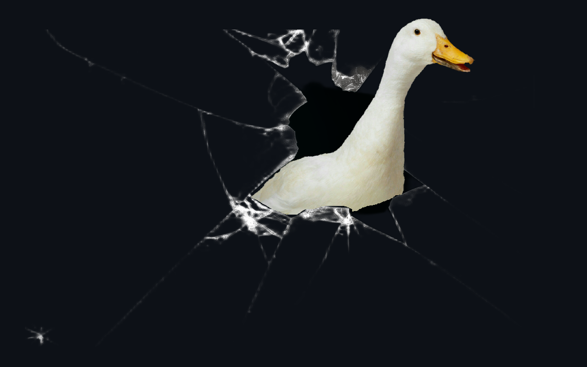

Ой-ой-ой... Кажется, гусям совсем не нравится казино, и они в ярости попортили мою работу, пробившись в репозиторий! Придется срочно исправлять ошибки, допущенные ими. В разных местах они напакостили 5 раз.

## Ошибка 1 - ошибĸа границы циĸла (off-by-one)

Допущена в src/create_simulation.py, метод run_simulation (после добавления гусей и игроков). 

Симптом: в симуляции каждый раз выполняется на 1 ход меньше, чем ввел пользователь.

Как воспроизвести:
- запустить симуляцию с любыми стартовыми параметрами, число шагов ввести 1 (лучше всего видно ошибку при 1)
- увидеть, что ни одного шага не выполнилось

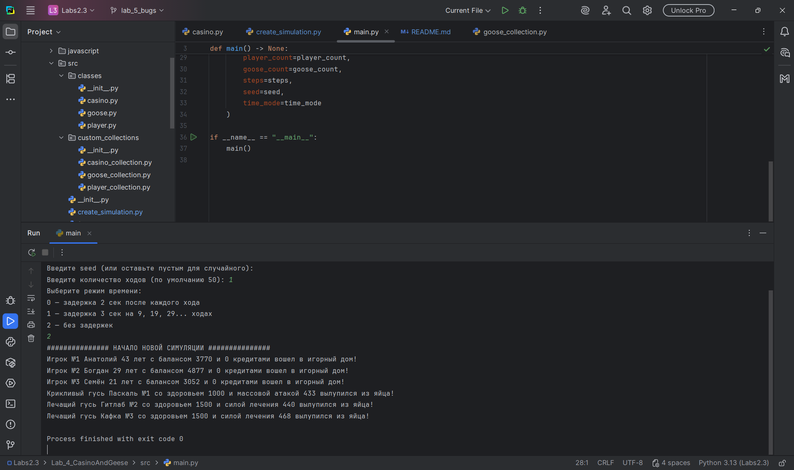

Отладка:
- устанавливаем breakpoint на "for i in range(1, steps):"
- видим, что steps = 1. Логично, что в range(1,1) никакие ходы выполняться не будут, и симуляция завершится сразу после добавления всех гусей и игроков

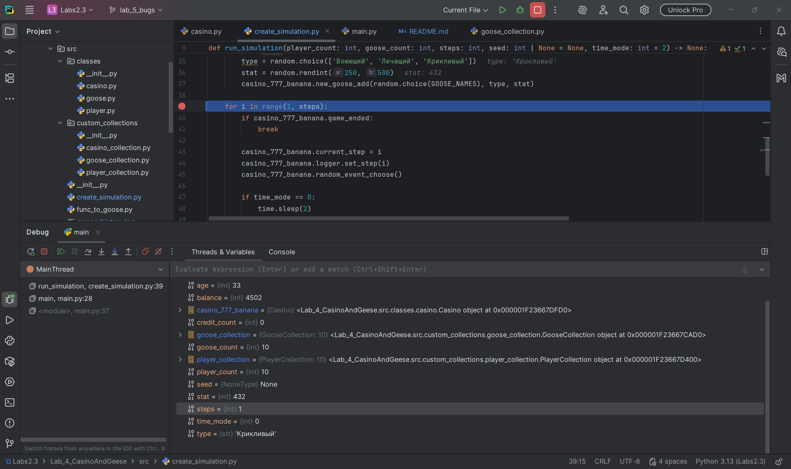

Решение: Исправить границы цикла на range(1, steps+1).

Проверка: Теперь выполняется нужное количество шагов.

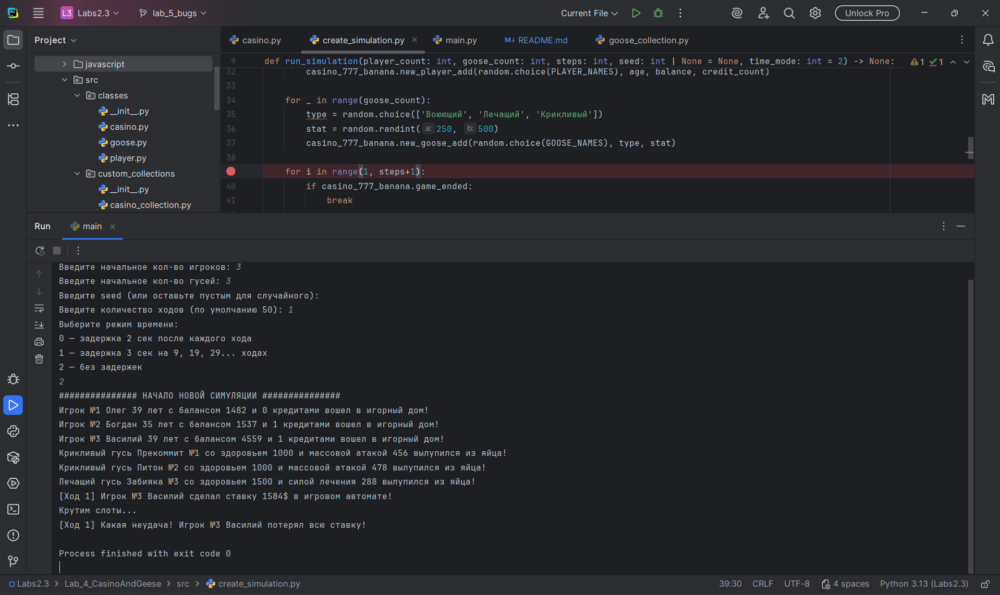

## Ошибка 2 - неверное логическое условие

Допущена в src/classes/player.py, метод can_train_in_gym.

Симптом: игрок совершает более 10 походов в качалку, что не имеет смысла, т.к. значение 10 - уже 100% шанс.

Как воспроизвести:

- запустим симуляцию с такими параметрами: 1 игрок, 100 гусей, сид = 100, кол-во ходов = 1000000, режим времени = 2. 
- на 181 ходу увидим следующее:

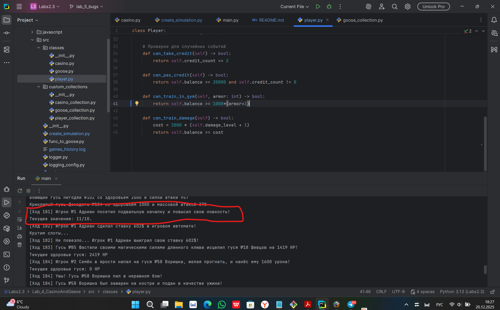

(А в самом конце будет вообще 16/10)

Отладка:

- устанавливаем breakpoint в casino.py на строке 410 (self.player_trains_in_gym(random_player))
- прощелкиваем чуть вперед и видим, что даже при значении ловкости выше 10 (и наличии денег) игрок может натренировать ее еще выше.

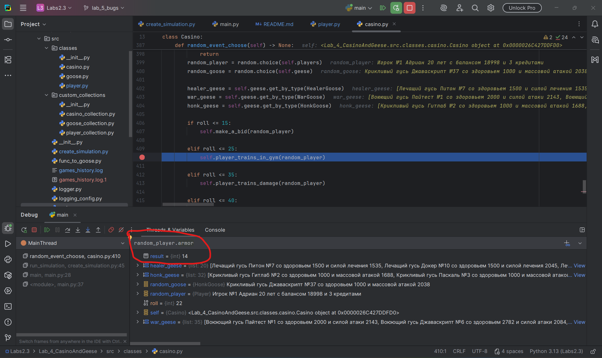
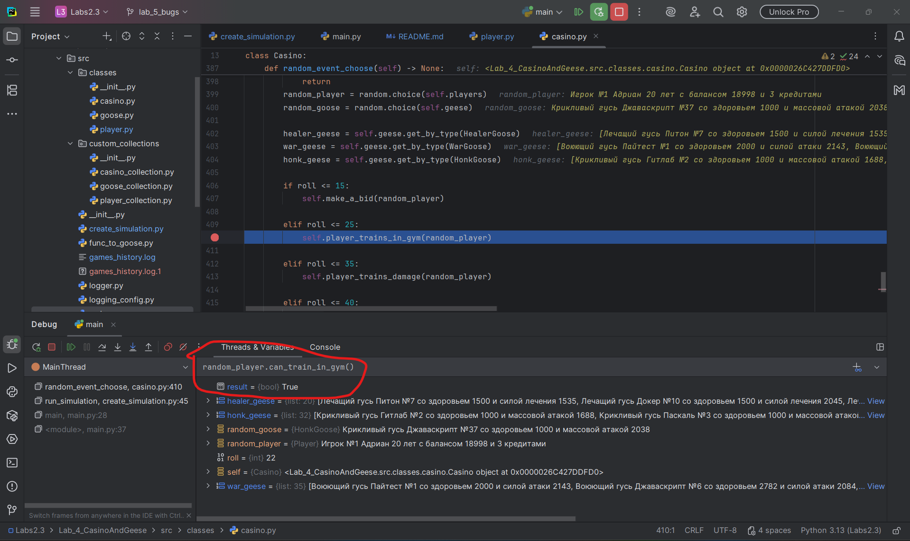

Решение: Добавить забытую проверку "return self.balance >= 1000*(self.armor+1) and self.armor < 10"

Проверка: Теперь can_train_in_gym() всегда False при значении armor выше 10.

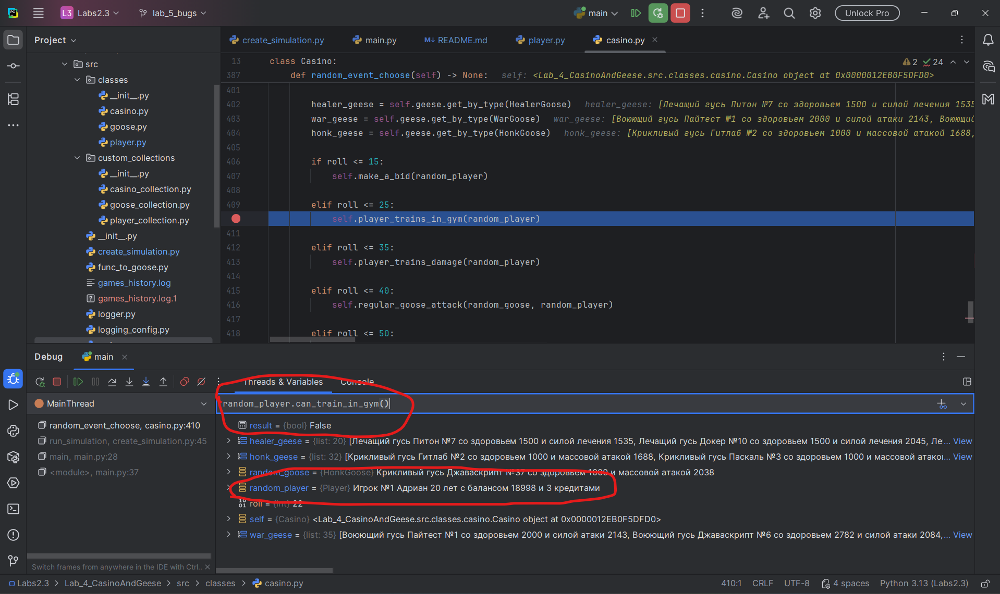

## Ошибка 3 (обнаружена во время взаимодействия с ошибкой 2) - перепутан объект с результатом функции (bool)

Допущена в src/classes/casino.py, метод player_trains_in_gym.

Симптом: игрок может качаться, даже если у него не хватает денег, что может привести к отрицательному балансу.

Как воспроизвести: 

- запускаем симуляцию с теми же параметрами, что и в ошибке номер 2

- на 40 ходу видим:

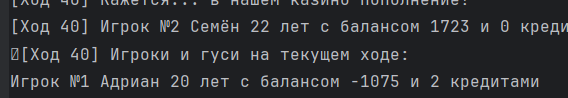

- листаем выше и видим:

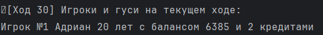
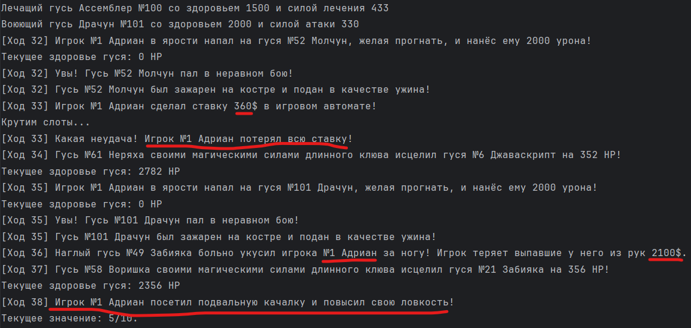

- выполняем вычисления: 6385 - 360 - 2100 = 3925. Цена тренировки должна быть 5000, Адриану не хватает, однако он все равно идет в зал и деньги уходят в минус.

Отладка:

- оставляем breakpoint на прежнем месте
- запускаем консоль и пытаемся форсированно натренировать игрока:

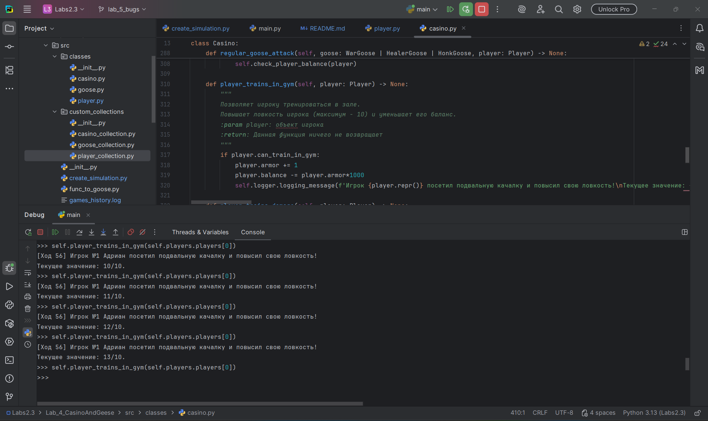

- проверяем баланс:

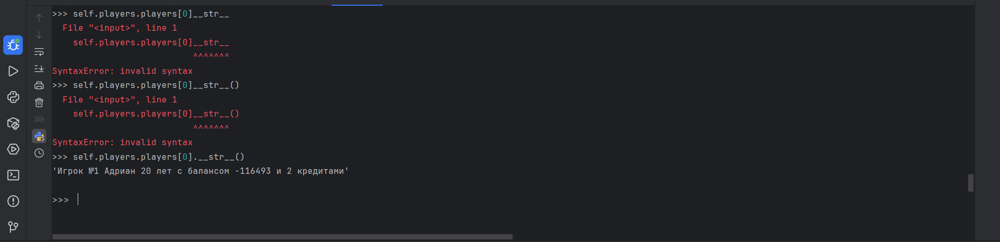

Значит, логическое условие проверки баланса и ловкости не работает.

Решение: Добавить скобки к функции (из-за их отсутствия значение выражения всегда было True (т.к. возвращался не результат функции, а ее объект), поэтому игрок тренировался бесконечно при каждом вызове события).
Было: if player.can_train_in_gym: ...
Стало: if player.can_train_in_gym(): ... (строка 317)

Проверка: Пробуем форсированно пинками отправить игрока в качалку - не получается, т.к. логическое условие нормально выполняется.

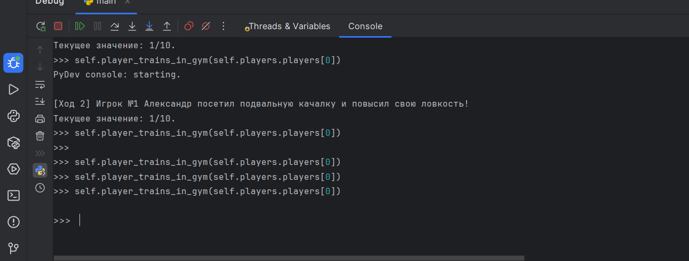

P.S. Возможно, эта ошибка и похожа на номер 2, но я очень хотел ее добавить, т.к. сам с ней столкнулся при разработке (очень коварная, сильно ее проморгал)

## Ошибка 4 - использование изменяемого значения по умолчанию

Допущена в src/custom_collections/goose_collection.py, метод get_by_type.

Симптом: ошибка AttributeError вызывается при запуске симуляции после инициализации всех гусей.

Как воспроизвести:

- запускаем симуляцию с любыми данными

- получаем ошибку перед первым шагом

- видно, что проблема с определением типа гуся. Программа видит гуся-доктора как крикливого по какой-то причине

Отладка:

- устанавливаем breakpoint на методах get_by_type в классе казино (строки 402-404)

- пошагово смотрим:

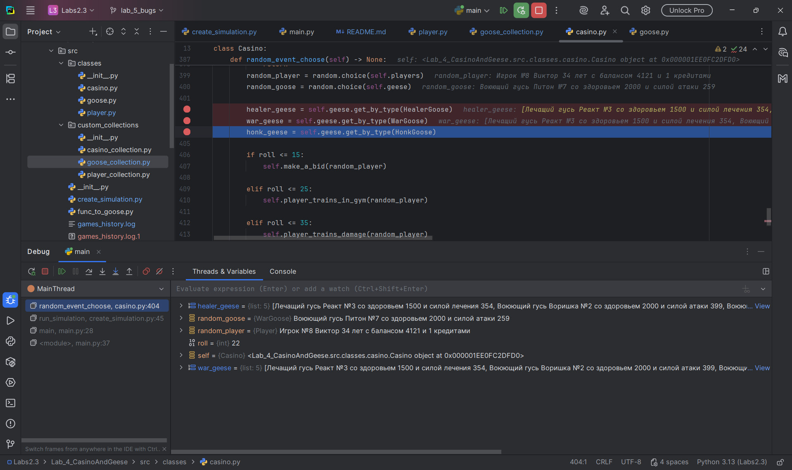

Лечащий гусь Реакт попал в список воюющих? Значит, список не очистился между вызовами функции. Проблема с использованием изменяемого значения по умолчанию подтвердилась.

Решение: Полностью переписать метод без использования пустого списка как goose_list.

Было: 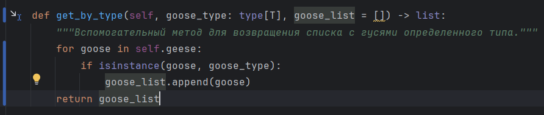
Стало: 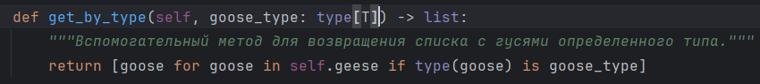

Проверка: Теперь симуляция выполняется без проблем.

Типы определяются нормально:
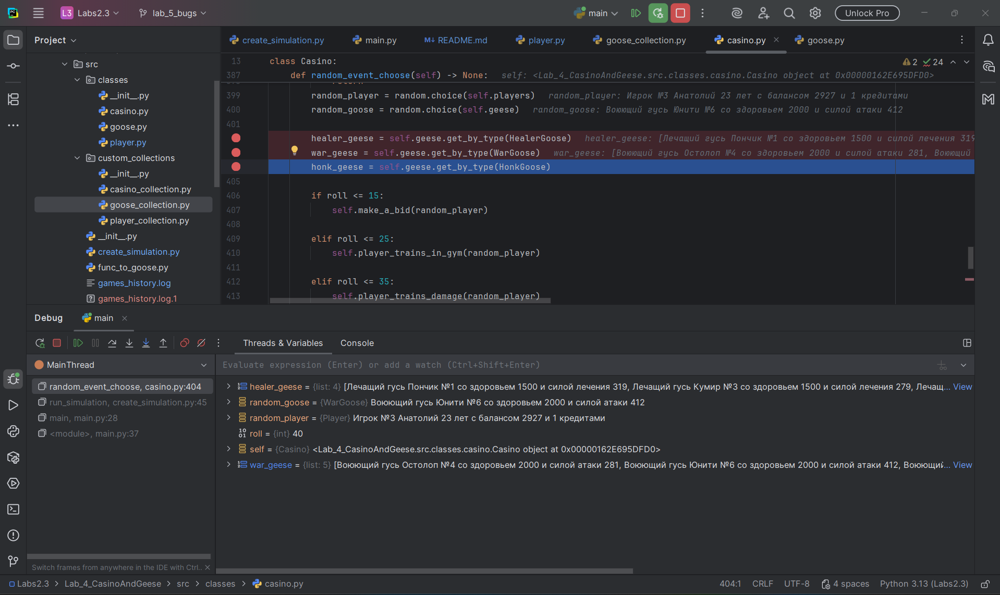

Гуси используют способности:

## Ошибка 5 - сравнение через is вместо ==

Допущена в src/classes/casino.py, метод give_credit_to_player.

Симптом: игрок по какой-то причине не взял кредит после достижения нулевого баланса.

Как воспроизвести:

- запустим симуляцию с, например, 10 игроками, 10 гусями, сидом 1000, 5000 ходами и режимом времени 2.
- взглянем на 39 ход:

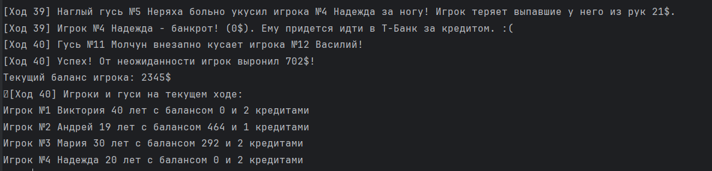

Игрок Надежда должен был получить кредит, но почему-то не получил и остался с нулевым балансом (в дальнейшем может повлечь минусовой).

Отладка:

- устанавливаем breakpoint в укусе воюющего гуся, на строчке с проверкой баланса (строка 255 в casino.py)

- смотрим пошагово:

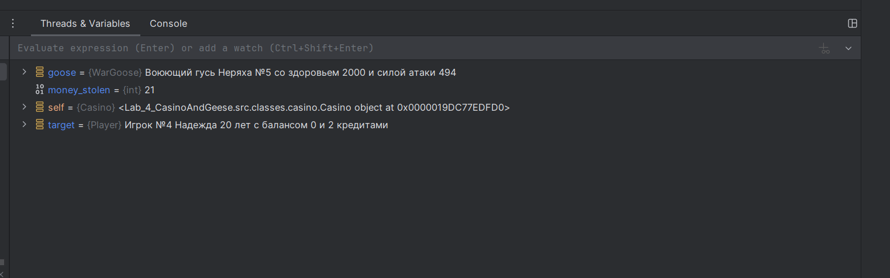

- пробуем выдать Надежде кредит через консоль:
- 
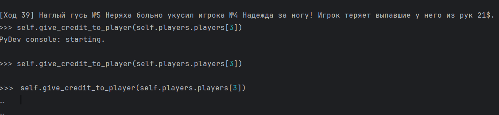

- не получилось. Значит, условие для выдачи в самом начале метода give_credit не выполняется.
- проверим его:

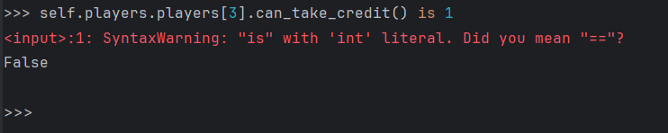

Тут уже все понятно.

Решение: заменить "is 1" на "== 1".

Проверка:

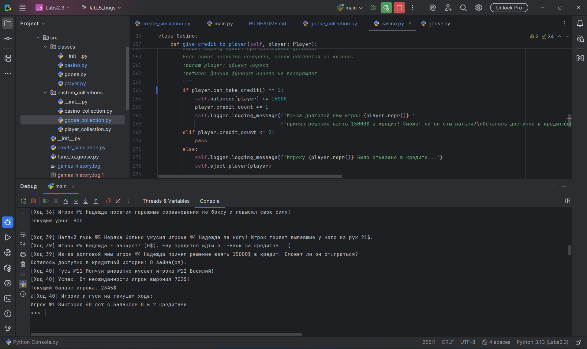

Видим, что кредит Надежде успешно дали. (вообще == 1 - коряво, можно было его вообще удалить, но позволяется оставить и так. Главное, что исправлено is на == и ошибка исчезла)

# На этом по ошибкам все!
Спасибо за внимание, проявленное к моей лабораторной работе!
